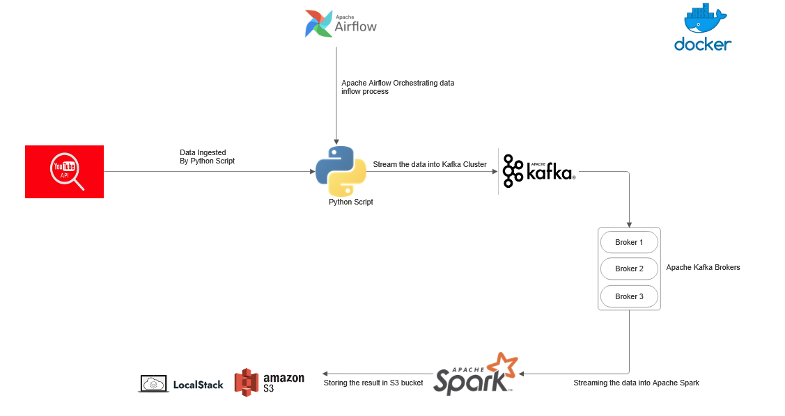

# YouTube Trend Analysis Pipeline

## Overview
This project implements an ETL (Extract, Transform, Load) pipeline to analyze trending YouTube videos using modern big data technologies. The pipeline collects data from the YouTube API, processes it with Apache Kafka, Apache Airflow, Apache Spark, and stores it in a LocalStack S3 bucket. The goal is to extract insights on video trends across regions (VN, US, KR) and visualize them using Jupyter Notebook.

## Pipeline


## Features
- **Data Extraction**: Fetches trending videos using the YouTube Data API v3.
- **Data Ingestion**: Streams data to a Kafka topic (`youtube_trending`) and saves to S3 (`youtube-trend-data`).
- **ETL Automation**: Orchestrates workflows with Airflow DAGs.
- **Data Transformation**: Processes data with Spark and stores as Parquet files.
- **Analysis & Visualization**: Performs exploratory data analysis (EDA) and creates charts with PySpark and Matplotlib.

## Technologies
- **YouTube API v3**: For data extraction.
- **Apache Kafka**: For real-time data streaming.
- **Apache Airflow**: For workflow scheduling and monitoring.
- **Apache Spark**: For large-scale data processing and SQL queries.
- **LocalStack**: Simulates AWS S3 for storage.
- **Docker**: Containerizes the entire stack.
- **Jupyter Notebook**: For interactive analysis and visualization.
- **Python**: Core programming language.

## Project Structure

├── dags/
│   ├── youtube_kafka_producer.py    # Producer script
│   ├── kafka_s3_consumer.py         # Consumer script
│   ├── spark_transformation.py      # Spark transformation
│   ├── youtube_kafka_etl_dag.py     # Airflow DAG for producer
│   └── kafka_s3_consumer_dag.py     # Airflow DAG for consumer
├── notebooks/
│   └── youtube_trend_analysis.ipynb # Jupyter Notebook for analysis
├── docker-compose.yml               # Docker configuration
└── README.md                        # This file

## Installation
1. **Clone Repository**:
   ```bash
   git clone <repository-url>
   cd D:\Nam3\Bigdata\API_Youtube

    Set Up Environment Variables:
        Add YOUTUBE_API_KEY to Airflow Variables via UI (http://localhost:8080) or CLI.
        Ensure Docker is installed and running.
    Run Docker Compose:
    bash

    docker-compose up -d
    Access Services:
        Airflow UI: http://localhost:8080
        Jupyter Notebook: http://localhost:8888 (get token from logs)

Usage

    Trigger DAGs:
        Run producer: airflow dags trigger youtube_kafka_etl
        Run consumer: airflow dags trigger kafka_s3_consumer_etl
    Analyze Data:
        Open youtube_trend_analysis.ipynb in Jupyter.
        Execute cells to load data from S3 and perform analysis.
    Monitor Logs:
        Check Airflow logs at /opt/airflow/logs/.
        Verify Kafka data with: docker exec kafka kafka-console-consumer --topic youtube_trending --bootstrap-server kafka:9092.

Analysis Insights

    Trending Categories: Identify top categories (e.g., Music, Gaming) by views or engagement.
    Regional Differences: Compare video popularity across VN, US, and KR.
    Engagement Metrics: Analyze (likes + comments) / views to gauge audience interaction.
    Visualizations include bar charts for category trends and line charts for temporal analysis.

Roadmap

    Short-term: Optimize API quota usage and add real-time Spark processing.
    Long-term: Integrate with a live AWS S3 bucket and deploy on a cloud platform.

Contributors

    Nguyễn Thành An

